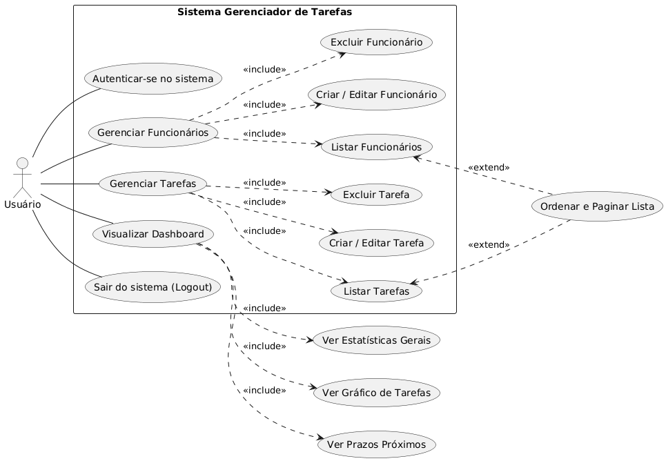

# Gerenciador de Tarefas

## 1. Visão Geral

O Gerenciador de Tarefas é uma aplicação web interna desenvolvida em PHP para facilitar a atribuição e o monitoramento de atividades dentro de uma equipe. A plataforma permite o cadastro de funcionários, a criação de tarefas com prazos e a sua delegação, além de fornecer uma visão geral do progresso através de um dashboard interativo.

### Funcionalidades Principais

*   **Autenticação de Usuários:** Sistema de login seguro para acesso à plataforma.
*   **Dashboard Interativo:** Painel com estatísticas, um resumo de tarefas com vencimento próximo e um gráfico de distribuição de tarefas por funcionário que distingue entre **Concluídas (verde)**, **Pendentes (amarelo)** e **Vencidas (vermelho)**. O gráfico é clicável para filtrar a lista de tarefas por funcionário.
*   **Gerenciamento de Funcionários:**
    *   CRUD (Criar, Ler, Atualizar, Excluir) completo para os funcionários.
    *   Listagem com ordenação por colunas.
*   **Gerenciamento de Tarefas:**
    *   CRUD completo para as tarefas.
    *   Listagem com ordenação, filtro por funcionário e **paginação interativa**.
    *   **Sinalização visual do estado:** as linhas da tabela são coloridas de verde claro (concluídas) ou vermelho claro (vencidas) para uma identificação rápida do estado de cada tarefa.
    *   Controle de itens por página e seleção direta da página desejada através de campos `select`.

## 2. Arquitetura

A aplicação foi construída com uma abordagem "vanilla", utilizando tecnologias consolidadas e sem a dependência de frameworks complexos, o que a torna leve e de fácil compreensão.

*   **Back-end:**
    *   **Linguagem:** PHP 8.0+.
    *   **Acesso ao Banco de Dados:** PDO (PHP Data Objects) com prepared statements para prevenir injeções de SQL.
    *   **Gerenciamento de Sessão:** Sessões nativas do PHP.

*   **Front-end:**
    *   **Estrutura e Estilo:** HTML5 semântico com [Bootstrap 4](https://getbootstrap.com/docs/4.5/getting-started/introduction/) para a interface.
    *   **Interatividade:** JavaScript puro (vanilla) para a submissão automática dos formulários de paginação e para a lógica de ordenação.
    *   **Visualização de Dados:** [Chart.js](https://www.chartjs.org/) para a renderização do gráfico de barras no dashboard.

*   **Banco de Dados:**
    *   **SGBD:** MySQL ou MariaDB.
    *   **Schema:** `funcionarios` (dados de acesso) e `tarefas` (detalhes das atividades).

## 3. Pré-requisitos

*   Ambiente de servidor web (XAMPP, WAMP, etc.).
*   PHP 8.0+.
*   MySQL 5.7+ ou MariaDB 10.2+.

## 4. Guia de Instalação e Configuração

**1. Clone o Repositório:**
```bash
git clone <url-do-repositorio>
cd <nome-do-repositorio>
```

**2. Crie o Banco de Dados:**
```sql
CREATE DATABASE gerenciador_tarefas CHARACTER SET utf8mb4 COLLATE utf8mb4_unicode_ci;
```

**3. Importe os Dados Iniciais:**
Importe o arquivo `tarefas.sql` para o banco de dados criado.

**4. Configure a Conexão:**
Edite o arquivo `db.php` com as suas credenciais de banco de dados (`host`, `db`, `user`, `pass`).

**5. Inicie o Servidor e Acesse:**
Inicie seu servidor local e abra `http://localhost/nome-do-repositorio/` no navegador. Use um dos logins de exemplo do `tarefas.sql` (ex: `ana.silva` / `senha123`).

## 5. Casos de Uso

Esta seção detalha as principais interações do usuário com o sistema.

### Diagrama de Casos de Uso



### Especificação dos Casos de Uso

| ID | Nome do Caso de Uso | Ator Principal | Descrição | Fluxo Básico | Pós-condição |
| :--- | :--- | :--- | :--- | :--- | :--- |
| UC01 | **Autenticar-se no sistema** | Usuário | Permite que um usuário com credenciais válidas acesse as funcionalidades do sistema. | 1. Acessa a página de login. <br> 2. Preenche os campos 'login' e 'senha'. <br> 3. Submete o formulário. <br> 4. O sistema valida as credenciais. | O usuário é redirecionado para o Dashboard e uma sessão é iniciada. |
| UC02 | **Visualizar Dashboard** | Usuário | Apresenta uma visão geral e consolidada sobre o estado atual das tarefas e da equipe. | 1. Navega para a página inicial. <br> 2. O sistema exibe cartões de resumo, um gráfico com a distribuição de tarefas (Concluídas, Pendentes e Vencidas) e uma lista de tarefas com prazo próximo. <br> 3. Clica em um funcionário no gráfico para filtrar a lista de tarefas. | O usuário obtém uma percepção rápida do andamento do trabalho, identificando visualmente os pontos críticos (tarefas vencidas). |
| UC03 | **Gerenciar Funcionários** | Usuário | Permite a gestão completa do cadastro de funcionários. | 1. Acessa a página "Gerenciar Funcionários". <br> 2. Adiciona, Edita ou Exclui um funcionário. | A lista de funcionários é atualizada. |
| UC04 | **Gerenciar Tarefas** | Usuário | Permite a gestão completa do ciclo de vida das tarefas. | 1. Acessa a página "Gerenciar Tarefas". <br> 2. Visualiza o estado das tarefas através das cores das linhas. <br> 3. Usa os seletores para ajustar a paginação. <br> 4. Adiciona, Edita ou Exclui uma tarefa. | A lista de tarefas é atualizada conforme a ação. |
| UC05 | **Sair do sistema (Logout)** | Usuário | Permite que o usuário encerre sua sessão de forma segura. | 1. Clica no link "Sair". | A sessão do usuário é encerrada e ele é redirecionado para a página de login. |
